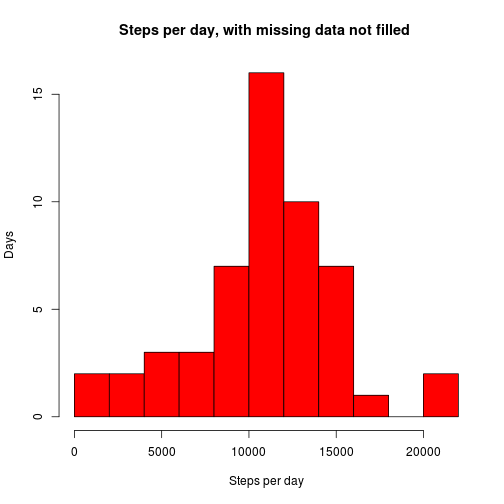
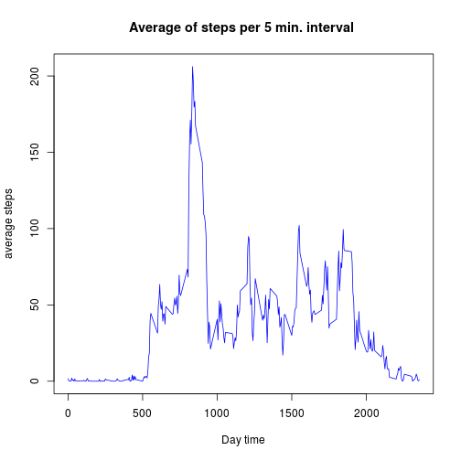
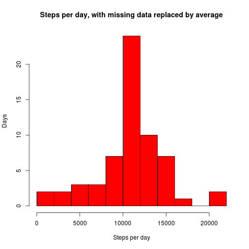
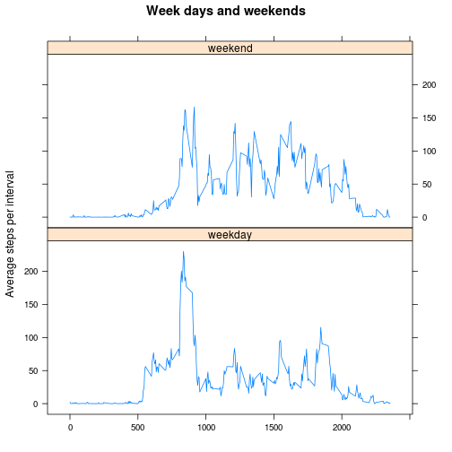

# Reproducible Research: Peer Assessment 1

## Packages and settings

Here is the part of the code corresponding to packages and settings we use. **Sys.setlocale** means switching the language to English, which is needed for the names of weekdays. Its parameter **C** is correct only for Linux, for another operating system, you should change it.


```r
library(lubridate)
library(dplyr)
library(lattice)
Sys.setlocale("LC_TIME", "C")
```

## Loading and preprocessing the data

Since the zipped data is already in our directory, we just unzip to read it. Then the interval and the number of of steps are interpreted as numeric, and the date is made *POSIXct* with the lubridate command **ymd**.

Note that "interval" seems to be a starting point for a five-minute interval of the day: for example, "1655" is followed by "1700", which means consecutive intervals "16:55-17:00" and "17:00-17:05". However, this assessment does not require to process this data into time format.


```r
a <- read.csv(unz("activity.zip","activity.csv"))
head(a)
```

```
##   steps       date interval
## 1    NA 2012-10-01        0
## 2    NA 2012-10-01        5
## 3    NA 2012-10-01       10
## 4    NA 2012-10-01       15
## 5    NA 2012-10-01       20
## 6    NA 2012-10-01       25
```

```r
a$interval<-as.numeric(a$interval)
a$steps<-as.numeric(a$steps)
a$date<-ymd(a$date)
```

## What is mean total number of steps taken per day?

**StepsPerDay** is a named vector whose values are total number of steps for each day. We immediately see that the total number of days was 61, and there are days with no data.


```r
StepsPerDay<-tapply(a$steps,a$date,sum)
length(StepsPerDay)
```

```
## [1] 61
```

```r
head(StepsPerDay)
```

```
## 2012-10-01 2012-10-02 2012-10-03 2012-10-04 2012-10-05 2012-10-06 
##         NA        126      11352      12116      13294      15420
```

Here is a histogram for the number of steps taken for day. We see that it really varies: there were two days with more than 20000 steps and two days with less than 2000 steps. The average is 10766.19 steps per day, and the median value is quite close to it.


```r
hist(StepsPerDay,breaks=10,col="red",ylab="Days",xlab="Steps per day",
     main="Steps per day, with missing data not filled")
```

 

```r
mean(StepsPerDay,na.rm=TRUE)
```

```
## [1] 10766.19
```

```r
median(StepsPerDay,na.rm=TRUE)
```

```
## [1] 10765
```

## What is the average daily activity pattern?

Here is a plot of daily activity pattern. As we can see, the person who took the measurements normally sleeps at night and moves at daytime: natural, isn't it?

```r
Z<-tbl_df(a) %>% group_by(interval) %>% summarise(mean(steps,na.rm=TRUE))
names(Z)<-c("interval","meansteps")
head(Z)
```

```
## Source: local data frame [6 x 2]
## 
##   interval meansteps
## 1        0 1.7169811
## 2        5 0.3396226
## 3       10 0.1320755
## 4       15 0.1509434
## 5       20 0.0754717
## 6       25 2.0943396
```

```r
plot(Z$interval,Z$meansteps,type="l",xlab="Day time",ylab="average steps",
     main="Average of steps per 5 min. interval",col="blue")
```

 

```r
Z$interval[Z$meansteps==max(Z$meansteps)]
```

```
## [1] 835
```

```r
max(Z$meansteps)
```

```
## [1] 206.1698
```

We also observe the peak of movements at the interval "835", meaning 8:35 AM. A reasonable conjecture is that it is the time to go to the office, by foot. Returning from the office is less visible since there is no usual time to leave. However, we observe a small peak around 12:00, probably corresponding to the lunch break, and two small peaks around 16:00 and between 18:00 and 19:00, probably corresponding to two most usual times to go home.

## Imputing missing values

As we see, there are 2304 missing values in our data frame **a**. We copy the data to a new data frame **a2** and fill each missing value of steps by the average number of steps from this interval, taken from the data frame **Z** constructed above. Each whole day of missing data has now exactly the average pattern, and in particular, 10766.19 steps in total.


```r
sum(is.na(a$steps))
```

```
## [1] 2304
```

```r
a2<-a
for (i in 1:nrow(a2)){
    if (is.na(a2$steps[i])){
        a2$steps[i]<-Z$meansteps[Z$interval==a2$interval[i]]
    }
}
StepsPerDay<-tapply(a2$steps,a2$date,sum)
head(StepsPerDay)
```

```
## 2012-10-01 2012-10-02 2012-10-03 2012-10-04 2012-10-05 2012-10-06 
##   10766.19     126.00   11352.00   12116.00   13294.00   15420.00
```

Because of this artificially added average data, the histogram has now a higher peak at the average value. The mean did not change, and the median is now equal to it, since the new "average" days are exactly in the middle of the distribution.


```r
hist(StepsPerDay,breaks=10,col="red",ylab="Days",xlab="Steps per day", 
     main="Steps per day, with missing data replaced by average")
```

 

```r
mean(StepsPerDay)
```

```
## [1] 10766.19
```

```r
median(StepsPerDay)
```

```
## [1] 10766.19
```


## Are there differences in activity patterns between weekdays and weekends?

We take the proceeded data **a2** and add a new column **week** whose value is equal to *weekday* unless the day was Saturday or Sunday, meaning *weekend*. The plot shows essential difference between activity on weekdays and weekends: the person who took the data wakes up a bit later on weekends, and  instead of going to the office, she/he moves more in total but less predictably.

Note that in this data, missing data was filled uniformly for weekdays and weekends, which spoils the picture. It would be more correct to take the original data, where the difference between weekdays and weekends is even more dramatic.


```r
a2$week<-"weekday"
a2$week[weekdays(a2$date)=="Saturday"|weekdays(a2$date)=="Sunday"]<-"weekend"
Zweek<-tbl_df(a2) %>% group_by(interval,week) %>% summarise(mean(steps))
names(Zweek)<-c("interval","week","meansteps")
head(Zweek)
```

```
## Source: local data frame [6 x 3]
## Groups: interval
## 
##   interval    week  meansteps
## 1        0 weekday 2.25115304
## 2        0 weekend 0.21462264
## 3        5 weekday 0.44528302
## 4        5 weekend 0.04245283
## 5       10 weekday 0.17316562
## 6       10 weekend 0.01650943
```

```r
attach(Zweek)
xyplot(meansteps ~ interval|week, xlab = "", ylab="Average steps per interval", type = "l",
      main = "Week days and weekends",layout = c(1, 2))
```

 
